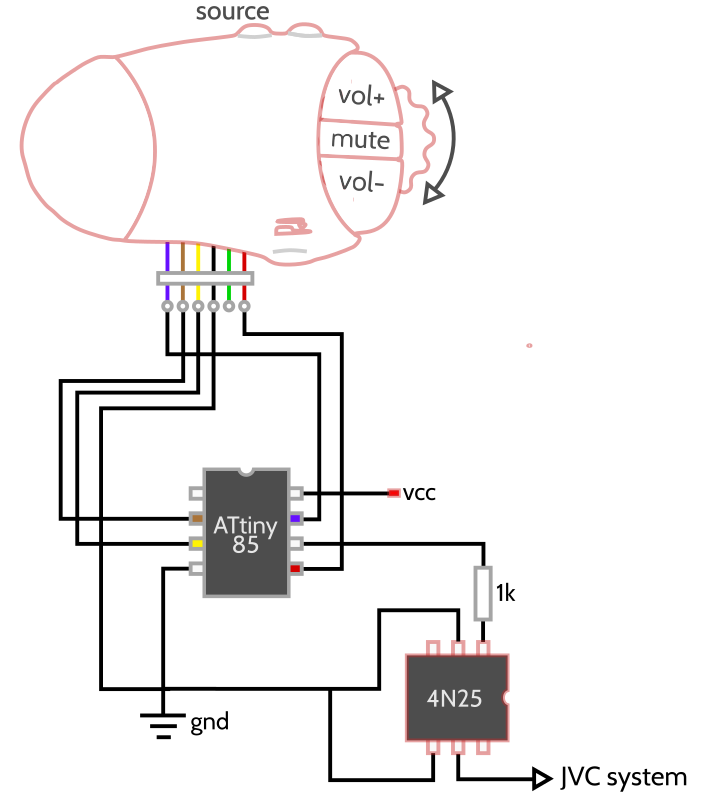
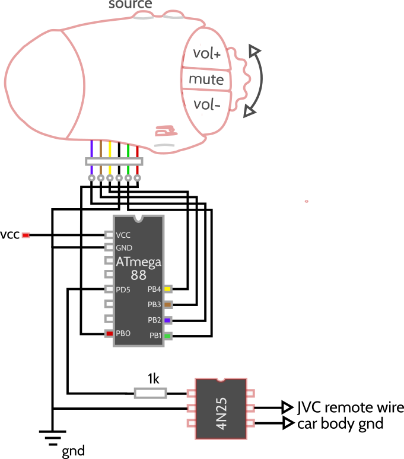

Circuit and code to convert button presses on a generic wired Renault remote to commands for an aftermarket JVC car stereo, using an ATtiny85 or an ATmega88.

Supports:
VOLUME_UP
VOLUME_DOWN
MUTE
SOURCE_CYCLE
FORWARD
BACKWARD

